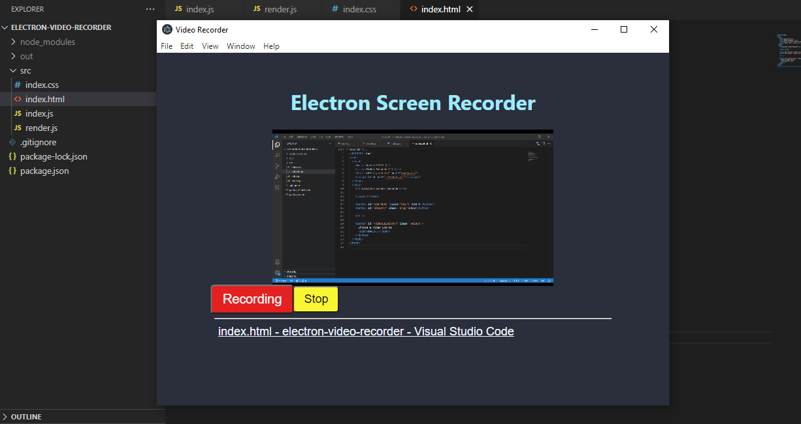

# Electron Video Recorder

A screen-recorder desktop app.

Additional description about the project and its features.

## Built With

- Electron.js
- Node
- Css

## Getting Started

To get a local copy up and running follow these simple example steps:

- Go to https://github.com/Alexoid1/Electron-video-recorder and clone the repo using:  
`https://github.com/Alexoid1/Electron-video-recorder.git` in your terminal.
- Cd file
- Run `npm i` in your terminal.
- Run `npm run make` in your terminal.
- Cd /out/make/squirrel.['system']
- Run  Setup.exe

To get a local copy  and to set it up and running follow these simple example steps.

### Prerequisites

- Node
- Download the code from repository (https://github.com/Alexoid1/Electron-video-recorder)

## Author

👤 **Pablo Alexis Zambrano Coral**

- Github: [@Alexoid1](https://github.com/Alexoid1)
- Twitter: [@pablo_acz](https://twitter.com/pablo_acz)
- Linkedin: [linkedin](https://www.linkedin.com/in/pablo-alexis-zambrano-coral-7a614a189/)

## Show your support

Give a ⭐️ if you like this project!

## 📝 License

This project is [MIT](LICENSE) licensed.#